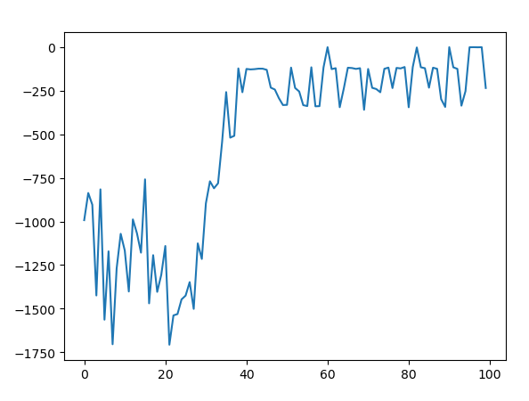
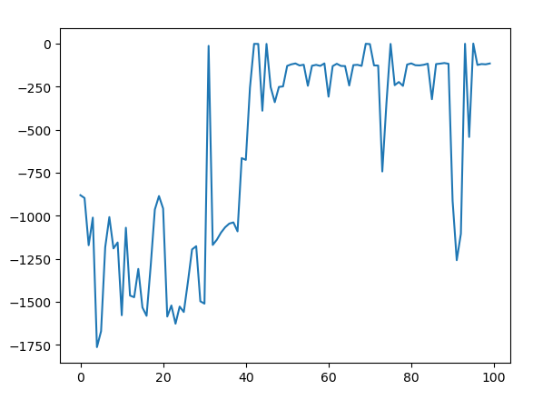
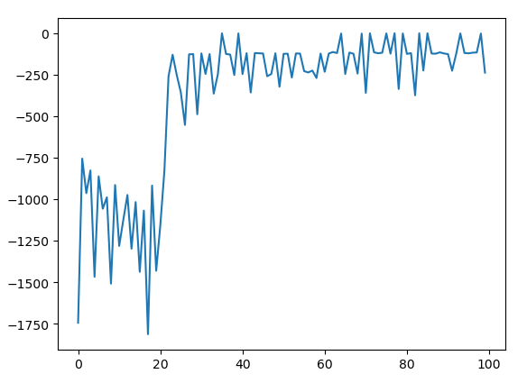

# README

This is a reinforcement learning algorithm library. The code takes into account both **performance and simplicity**, with **little dependence**. The algorithm code comes from spinningup and some researchers engaged in reinforcement learning.

## Algorithms

The project covers the following algorithms：

* **DQN, Dueling DQN, D3QN**
* **DDPG, DDPG-HER, DDPG-PER**
* **PPO+GAE, Multi-Processing PPO, Discrete PPO**
* **TD3, Multi-Processing TD3**
* **SAC**
* **MADDPG**

All the algorithms adopt the **pytorch** framework. All the codes are combined in the easiest way to understand, which is suitable for beginners of reinforcement learning, but the code performance is excellent.

## Reference

This project also provides the reference of these algorithms:

* Multi-Agent Actor-Critic for Mixed Cooperative-Competitive Environments
* CONTINUOUS CONTROL WITH DEEP REINFORCEMENT
* High-Dimensional Continuous Control Using Generalized Advantage Estimation
* Proximal Policy Optimization
* Soft Actor-Critic Off-Policy Maximum Entropy Deep Reinforcement Learning with a Stochastic Actor
* Auto alpha  Soft Actor-Critic Algorithms and Applications
* Addressing Function Approximation Error in Actor-Critic Methods

## Results

Testing environment: **'Pendulum-v0'**. What you just need to do is running the **main.py**. Here are the results of several cases:

spinningup-DDPG reward curve:



spinningup-TD3 reward curve:



spinningup-SAC reward curve:



## Project tree

```
DRL_algorithm_library
├─ Arm_env.py
├─ DDPG
│    ├─ DDPG
│    ├─ DDPG_spinningup
│    └─ DDPG_spinningup_PER
├─ DQN_family
│    ├─ Agent.py
│    ├─ __pycache__
│    ├─ core.py
│    ├─ main.py
│    └─ runs
├─ MADDPG
│    ├─ .gitignore
│    ├─ .idea
│    ├─ __pycache__
│    ├─ arguments.py
│    ├─ enjoy_split.py
│    ├─ logs
│    ├─ main_openai.py
│    ├─ model.py
│    ├─ models
│    └─ replay_buffer.py
├─ PPO
│    ├─ .idea
│    ├─ DiscretePPO
│    ├─ PPOModel.py
│    ├─ TrainedModel
│    ├─ __pycache__
│    ├─ core.py
│    ├─ draw.py
│    ├─ multi_processing_ppo
│    └─ myPPO.py
├─ README.md
├─ SAC
│    ├─ SAC_demo1
│    └─ SAC_spinningup
├─ TD3
│    ├─ .idea
│    ├─ Multi-Processing-TD3
│    ├─ TD3
│    ├─ TD3_spinningup
│    └─ TrainedModel
├─ __pycache__
│    ├─ Arm_env.cpython-36.pyc
│    └─ Arm_env.cpython-38.pyc
├─ imgs
│    ├─ spinSAC.png
│    ├─ spin_ddpg.png
│    └─ spin_td3.png
└─ reference
       ├─ 多智能体 MADDPG - Multi-Agent Actor-Critic for Mixed Cooperative-Competitive Environments - 1706.02275.pdf
       ├─ 强化学习 DDPG - CONTINUOUS CONTROL WITH DEEP REINFORCEMENT 1509.02971.pdf
       ├─ 强化学习 GAE High-Dimensional Continuous Control Using Generalized Advantage Estimation 1506.02438.pdf
       ├─ 强化学习 PPO - Proximal Policy Optimization1707.06347.pdf
       ├─ 强化学习 SAC1 - Soft Actor-Critic Off-Policy Maximum Entropy Deep Reinforcement Learning with a Stochastic Actor - 1801.01290.pdf
       ├─ 强化学习 SAC2 auto alpha  Soft Actor-Critic Algorithms and Applications 1812.05905.pdf
       └─ 强化学习 TD3 - Addressing Function Approximation Error in Actor-Critic Methods 1802.09477.pdf
```

## Requirements

gym==0.10.5

matplotlib==3.2.2

pytorch==1.7.1

numpy==1.19.2


